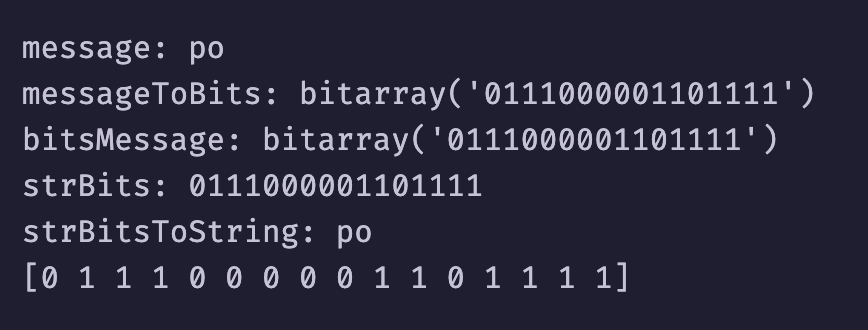
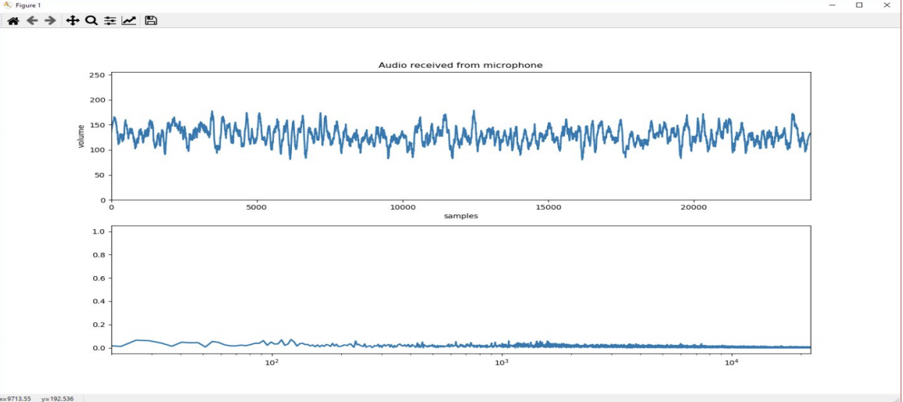

# Made in partnership with:
[Renan Goes](https://github.com/Renan-Goes)

# Frequency Recognizer 🔊
  Final project of computer networks discipline at UFPB, the idea is that one computer will encode a message in bits and transmit it 
to another machine using sound frequencies, while the other will try to listen and decode the original message

# How to Run
```
python encoder.py
```
```
python decoder.py
```
# Results


